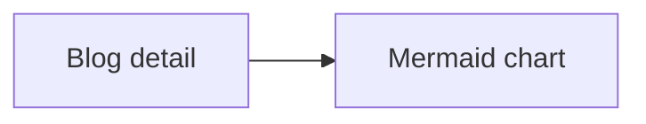

# E2E Welcome

This blog entry makes the generated homepage exercise the blog and content pipeline.

## What this fixture covers

The Playwright suite uses a real Release CLI build and a temporary output directory.

## Verification details

The second chapter checks that the blog TOC follows the selected section.

