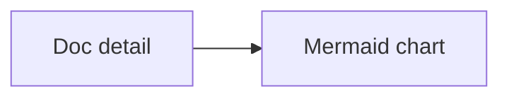

# MyProduct Site Docs

This small docs tree keeps the homepage Docs section populated while the product tree exercises the independent product routes.

> A documented quote.
>
> It remains readable in the default dark theme.

## Architecture details

This section gives the documentation page a second navigable chapter.

## Release notes

The second chapter is used to verify TOC selection state.

